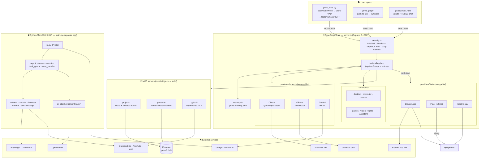

# Jarvis — Architecture

This repo holds **two coexisting Jarvis systems** plus three MCP tool servers:

1. **TypeScript brain** (`server.ts`) — the running voice-assistant loop on `:8787`
2. **Python "Mark XXXIX-OR"** (`main.py`) — a standalone PyQt6 + Gemini desktop app
3. **MCP tool servers** (`mcp-servers/`) — projects, petsacre (Firestore), pytools

## How a turn flows (TS brain)

1. **Input** — ears/PTT (voice→Whisper) or the web chat UI `POST /turn`.
2. **Security** — `security.ts` rate-limits, validates, enforces loopback.
3. **Think** — the loop calls the active brain provider (Claude / Ollama / Gemini) with the system prompt + memory preamble + tool schemas.
4. **Act** — tool calls dispatch to local `tools/*` or to an MCP server over stdio; `projects`/`petsacre` hit **Firestore**, `pytools` does web/clipboard/system.
5. **Remember** — useful facts persist to `jarvis-memory.json`.
6. **Speak** — reply text → TTS provider (ElevenLabs / Piper / say) → `afplay`/speaker; text returned to the caller.

The **Python Mark XXXIX-OR app** (`main.py`) is independent: its own PyQt6 UI, Gemini/OpenRouter brains, and `actions/` for browser (Playwright), desktop control, and content — it does **not** route through `server.ts`.
